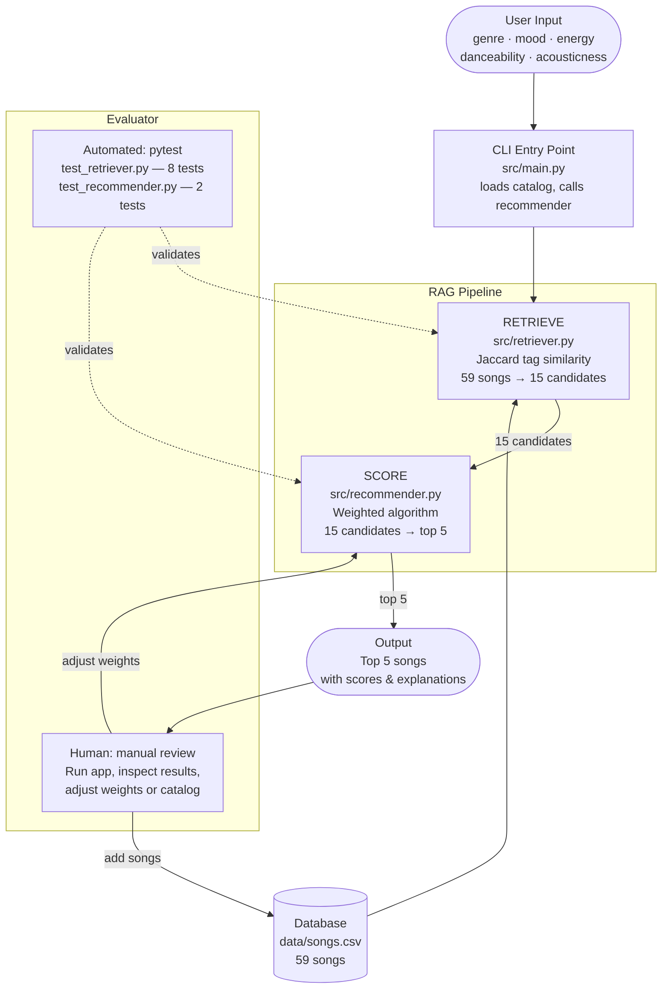

Ryan Shankar

- Original Project: Music recomender Simulation
    - The music recommenders goals were to goals were to:
        - Help identify songs that were similar to each other, to recommened similar song to the user
        - Create a realistic point system using different features as different weights prioritizing the ones that mattered most to the user, or in this case the creator, since we had some part in the decision of what features to prioriztize.
- The system diagram below, covers how the whole updated recommender works:
    - It takes user input, then places it in the RAG pipeline to get scores for the user's prefrences. Finally it outputs the top 5 songs and gives a reason.


- Setup Instructions:

### 1. Go to the project folder
```bash
cd ai110-module3show-musicrecommendersimulation-starter
```

### 2. Create and activate a virtual environment (first time only)
```bash
python3 -m venv .venv
source .venv/bin/activate
```
If you already have one, just activate it:
```bash
source .venv/bin/activate
```

### 3. Install dependencies (first time only)
```bash
pip install -r requirements.txt
```

### 4. Run the recommender
```bash
python src/main.py
```
This loads all 59 songs, runs 6 user profiles through the RAG pipeline, and prints the top 5 recommended songs for each with scores and explanations.

### 5. Run the tests
```bash
python -m pytest tests/ -v
```
You should see **10 passed** — 2 tests for the scorer and 8 tests for the retriever.


# Music Recommender — System Diagram



## Component key

| Component | File | Role |
|---|---|---|
| CLI Entry Point | `src/main.py` | Loads the catalog, defines user profiles, calls the recommender, and prints results |
| Database | `data/songs.csv` | 59 songs, each with genre, mood, energy, danceability, and acousticness |
| Retriever | `src/retriever.py` | RAG step 1 — tag-based Jaccard similarity narrows 59 songs to 15 candidates |
| Scorer | `src/recommender.py` | RAG step 2 — weighted algorithm ranks 15 candidates, returns top 5 with explanations |
| Automated Evaluator | `tests/` | pytest runs 10 tests that validate retriever correctness and scorer output |
| Human Evaluator | — | You run the app, read the printed results, and decide whether to adjust weights or add songs |
